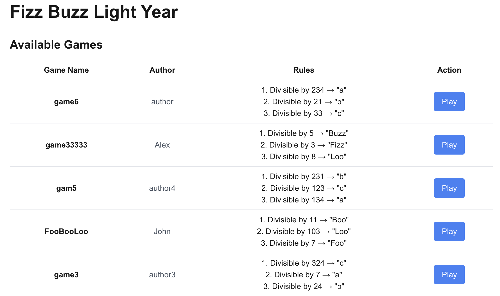
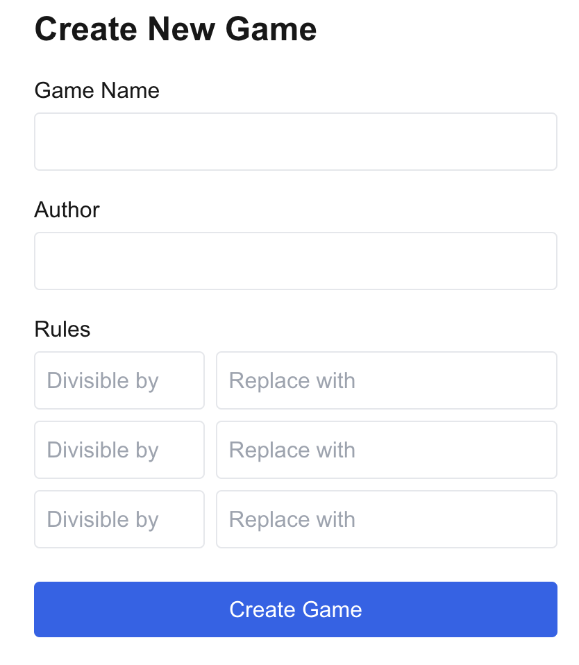
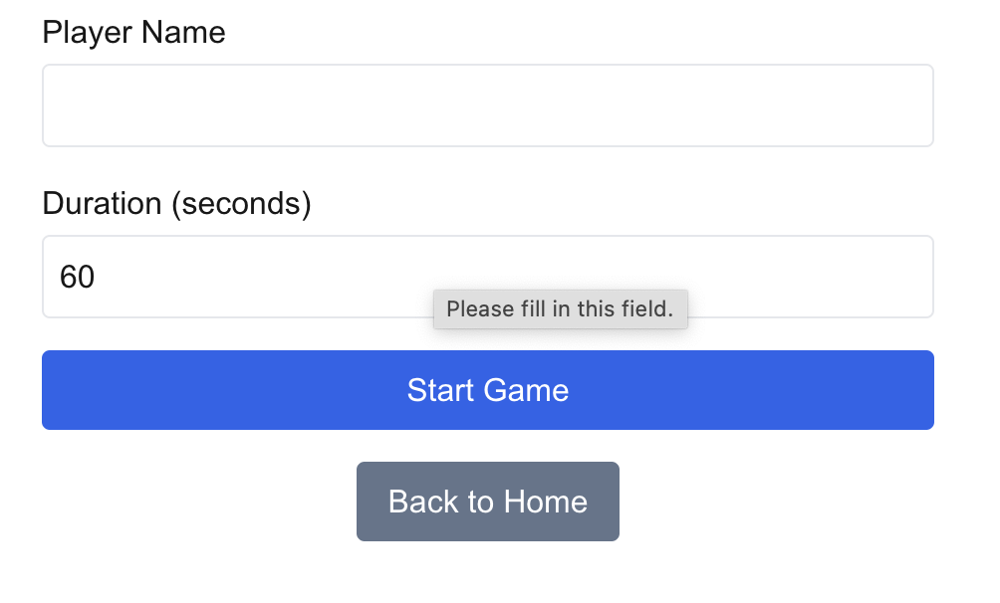
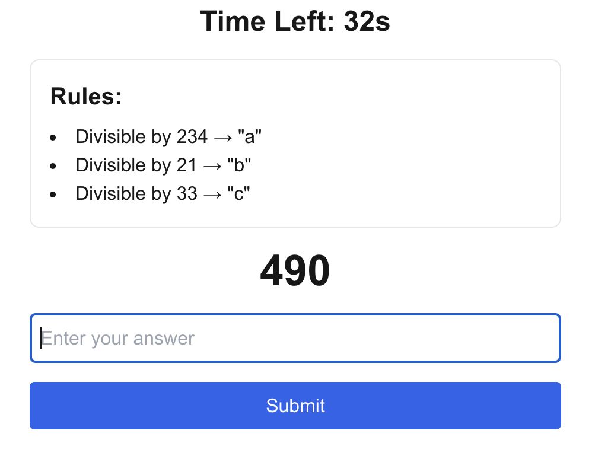
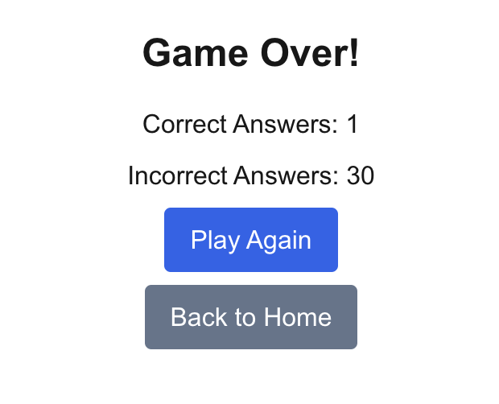

# FizzBuzzLightYear

## Overview

FizzBuzzLightYear is an online gaming application that allows users to create, manage, and play custom FizzBuzz-like games. Users can define their own set of rules for the game, based on divisibility, and play timed sessions where random numbers are generated, and the player must respond according to the game's custom rules.

## Features

- **Create Custom Games**: Users can define new games with custom rules for number replacement.
- **Game Play**: Players receive random numbers and must respond with the appropriate replacement, continuing until the timer runs out.
- **Score Tracking**: At the end of each session, the player's score is displayed, showing correct and incorrect answers.
- **Unique Game Names**: Each game is stored with a unique name and the author's details.

## Screenshots

- **Homepage**: Displays a list of all available games with their rules, allowing users to select one to play.</br>
  

- **Create New Game**: A simple form for users to define the name, author, and rules for a new game.</br>
  

- **Start New Game**: Before starting, players can set their name and the duration of the game session.</br>
  

- **Gameplay Interface**: The main game screen, showing the countdown timer, rules, a random number, and the input field for the answer.</br>
  

- **Game Over Screen**: After the timer runs out, this screen displays the final score with correct and incorrect answer counts.</br>
  


## Tech Stack

- **Frontend**: Next.js with TypeScript for fast and modular single-page application development.
- **Backend**: ASP.NET 8 Web API using Entity Framework Core for efficient server-side processing.
- **Database**: SQLite for lightweight and flexible data management.
- **Containerization**: Docker used for packaging the entire solution for easy deployment.

## Current Progress

- **API**: Complete.
- **Frontend**:
  - **Game Creation**: Completed UI for viewing and creating new games with rules.
  - **Game Play and Stats**: Completed UI for gameplay and result.

## Requirements

- **Custom Game Creation**: Users define divisibility rules and name the game.
- **Random Number Generation**: Server generates random numbers for gameplay.
- **Answer Verification**: Server validates player responses.
- **Timer**: Players can set the duration of the game session.
- **Duplicate Numbers**: No duplicate random numbers within a single session.
- **Score Display**: Total correct and incorrect answers shown at the end of the game.

## Build Instructions

### Option 1: Running with Docker Compose

1. **Clone the repository**:

   ```bash
   git clone https://github.com/username/FizzBuzzLightYear.git
   ```

2. **Navigate to project directory**:

   ```bash
   cd FizzBuzzLightYear
   ```

3. **Build and run with Docker Compose**:

   ```bash
   docker compose up --build
   ```

4. **Access the application**:
   - Frontend: http://localhost:3000
   - Backend API: http://localhost:8080
   - Swagger Documentation: http://localhost:8080/swagger

### Option 2: Running Locally

1. **Clone the repository**:

   ```bash
   git clone https://github.com/username/FizzBuzzLightYear.git
   ```

2. **Navigate to project directory**:

   ```bash
   cd FizzBuzzLightYear
   ```

3. **Install frontend dependencies**:

   ```bash
   npm install
   ```

4. **Run API migrations**:

   ```bash
   dotnet ef database update
   ```

5. **Run the application**:
   - **Backend**:
     ```bash
     dotnet run
     ```
   - **Frontend**:
     ```bash
     npm run dev
     ```

## Project Structure

```
FizzBuzzLightYear/
├── frontend/               # Next.js frontend application
├── FizzBuzzLightYearAPI/  # ASP.NET backend API
├── db/                    # SQLite database directory
├── docker-compose.yml     # Docker Compose configuration
└── README.md
```

## Future Goals

- ~~Containerization~~ ✅
- Break frontend down to more components
- Display answer feedback when game finish
- Add testing functions for backend and frontend

## Known Issues

- Occasional delays in response from large game sessions.
